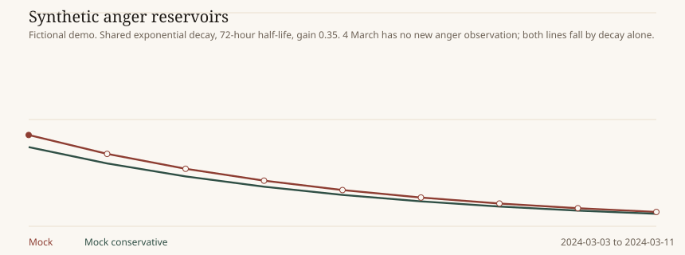

# Serah

Longitudinal probabilistic emotional-state observatory.

Serah keeps five layers apart: the words that were said, the taxonomy used to name them, the probabilistic score an engine gives those words, the decaying reservoir derived from those scores, and the chart that shows the result. The same evidence, taxonomy, questions, and decay can be sent to more than one System-1 engine. The lines differ only because the scores differ.

A number on the chart means: given this evidence, this concept definition, this question version, this engine, and this experimental temporal model, the derived intensity is this value on Serah's 0–100 scale. It is not a measurement of a nervous system, and it is not a clinical finding.

## What Serah is not

Serah is not a diagnostic system, a risk score, a happiness score, or a wellness score. It does not reduce a person to one number. It does not treat a model's probability as psychological truth. Assistant text is context. It becomes evidence only when the user's own words endorse it. A day with no observation is not a score of zero.

## The synthetic trajectory

The fictional demo shows anger rising, decaying across a day with no anger evidence, then rising again. Mock and Mock conservative share the decay and differ only in scoring.



## Quick start

```bash
python3 -m venv .venv
.venv/bin/pip install -e ".[dev]"
.venv/bin/serah demo
cd frontend && npm install && npm test && npm run build && cd ..
.venv/bin/serah serve
```

Open http://127.0.0.1:8740 . Nothing in that path calls a paid API or downloads model weights.

`serah doctor` reports which engines are available. A missing engine does not stop the others.

## Demo

`serah demo` imports a fictional ChatGPT-shaped history, extracts episodes with the mock lexicon, reviews the taxonomy day by day, scores `mock` and `mock_conservative`, and replays a 72-hour exponential reservoir. Run it again and it keeps the same observations.

The history is entirely made up. It includes a day with no emotional evidence, two episodes on one day, and a compression, obligation pressure, that is proposed, then a candidate, then active only after repeated days. Earlier days are not rewritten when it activates.

## Importing a history

```bash
serah import /path/to/conversations.json
serah extract
serah taxonomy replay
serah score --engine mock
serah replay --half-life-hours 72
```

The importer accepts a ChatGPT `conversations.json`, a directory of those files, or a zip. It keeps titles, roles, timestamps, and the current branch. Messages off the current branch are stored and are not extracted. Repeating an import skips conversations already stored. Malformed records produce warnings and are not dropped silently.

Real exports stay on the machine that imported them. See [PRIVACY.md](PRIVACY.md).

## Changing the half-life

```bash
serah replay --half-life-hours 24
```

This clones the experiment and replays. Raw observations stay as they were. The same control is on the Replay settings screen.

## Providers

| Engine | Status without setup | What it calls |
| --- | --- | --- |
| mock, mock_conservative | Available | Deterministic local lexicon |
| laya | Not configured until `laya` is installed | `Router.predict` / `predict_batch` |
| jev | Not configured until an API key is set | `POST /v1/systemone` |
| kai | Not configured until `KAI_BASE_URL` is set | System One HTTP |
| decider | Not configured until a base URL or local package is set | System One HTTP or `decider.infer.Decider` |
| llm_baseline | Not configured until an OpenAI-compatible base URL and model are set | Chat completions, schema-checked |

Details, including why the shared score instrument has ten levels rather than eleven, are in [MODEL_ADAPTERS.md](MODEL_ADAPTERS.md). Copy [.env.example](.env.example) to `.env` if you configure any of them. Serah does not invent a distribution an engine did not return.

## Documentation

- [ARCHITECTURE.md](ARCHITECTURE.md)
- [DATA_MODEL.md](DATA_MODEL.md)
- [TAXONOMY.md](TAXONOMY.md)
- [TEMPORAL_MODEL.md](TEMPORAL_MODEL.md)
- [MODEL_ADAPTERS.md](MODEL_ADAPTERS.md)
- [PRIVACY.md](PRIVACY.md)
- [DEVELOPMENT.md](DEVELOPMENT.md)
- [SPEC_REVIEW.md](SPEC_REVIEW.md)
- [Code and requirements review, 2026-09-26](docs/review-2026-09-26.md): open work items

## Licence

Apache-2.0, matching the public sibling projects (Keziah, Hoglah, Deborah, and most of the rest).
